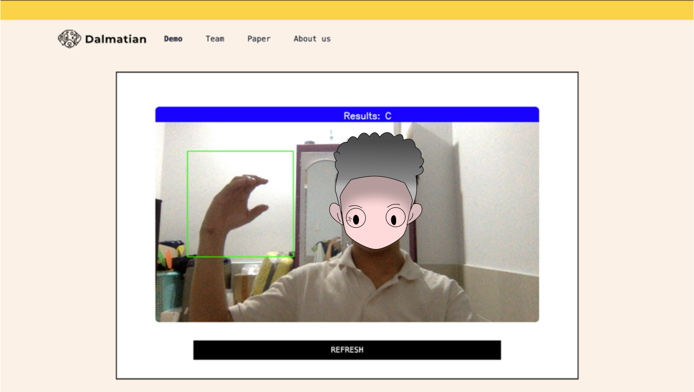

# Deteksi Bahasa Isyarat Menggunakan Flask

## Ringkasan:
**Projek dibagi menjadi 2 part:**
1. Pertama, training dataset untuk mendapatkan file model h5 [disini](https://github.com/Harly-1506/American-Sign-languages-datasets-Classification)
2. Kedua, deploy ke framework flask yang nantinya akan saya jelaskan pada repository ini

**Project ini menggunakan Flask untuk backend dan Tailwind untuk Frontend, lalu menggunakan [Mediapipe](https://google.github.io/mediapipe/) untuk pengenalan tangan**
**Beberapa isi file singkat dalam repositori ini 👇:**
1. requirements.txt : diperlukan untuk menjalankan aplikasi ini.
2. app.py : ini bagian terpenting karena berisi kode untuk proses dan menjalankan aplikasi
3. template/ : Folder berisi semua kode html untuk frontend
4. Yang lain : Hampir merupakan elemen statis untuk frontend dan beberapa hasil dari aplikasi.


## How to run 🏃!!:
* You must to have all src code:
```bash
~ git clone https://github.com/RC-Sho0/ASL-web-demo.git
~ cd ASL-web-demo
```
* Setup enviroment:
```bash
~ pip install -r requirements.txt
```
* Run server:
```bash
~ python install server.py
```
* Open browser and connect this path:
```bash
http://127.0.0.1:5000
```

## My website look like this 



**Wow now u can using my app!!! That cool right?**

**If you like that, please Star my repo 🌟**

**And if you want to support let follows my github 🎆**


--------------------------------------------------------------
***Authorized by Sho0***
