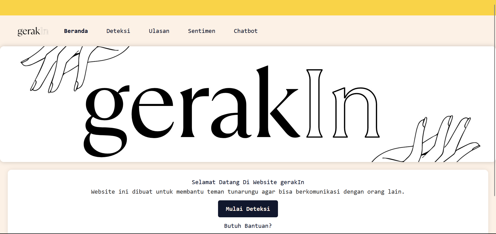
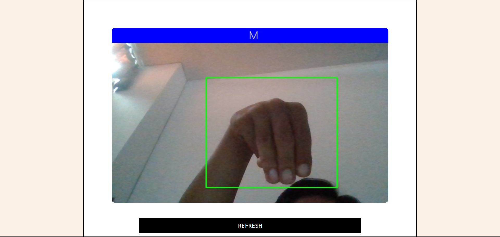

# Deteksi Bahasa Isyarat Menggunakan Flask

## Ringkasan:
**Projek dibagi menjadi 2 part:**
1. Pertama, training dataset untuk mendapatkan file model h5 [disini](https://github.com/Harly-1506/American-Sign-languages-datasets-Classification)
2. Kedua, deploy ke framework flask yang nantinya akan saya jelaskan pada repository ini

**Project ini menggunakan Flask untuk backend dan Tailwind untuk Frontend, lalu menggunakan [Mediapipe](https://google.github.io/mediapipe/) untuk pengenalan tangan**
**Beberapa isi file singkat dalam repositori ini 👇:**
1. requirements.txt : diperlukan untuk menjalankan aplikasi ini.
2. app.py : ini bagian terpenting karena berisi kode untuk proses dan menjalankan aplikasi
3. template/ : Folder berisi semua kode html untuk frontend
4. Yang lain : Hampir merupakan elemen statis untuk frontend dan beberapa hasil dari aplikasi.


## Langkah-langkah untuk menjalankan🏃!!:
* Clone terlebih dahulu atau bisa download lalu ekstrak:
```bash
~ git clone https://github.com/rafaelrinta/capstone-bahasa-isyarat.git
~ cd capstone-bahasa-isyarat
```
* Install enviroment:
```bash
~ pip install -r requirements.txt
```
* Run server stremlit:
```bash
~ streamlit run sentimen.py
```
* Run server Flask:
```bash
~ flask run
```
* Buka browser dan jalankan url:
```bash
http://127.0.0.1:5000
```

## Tampilan Web Ketika Berhasil di jalankan




**Sekarang kamu bisa menjalankan project ini, keren bukan?**

**Jangan lupa 🌟🌟 repositori ini, jika kamu suka dengan project yang saya bagikan**

**Support dengan cara follow github saya 🎆**
